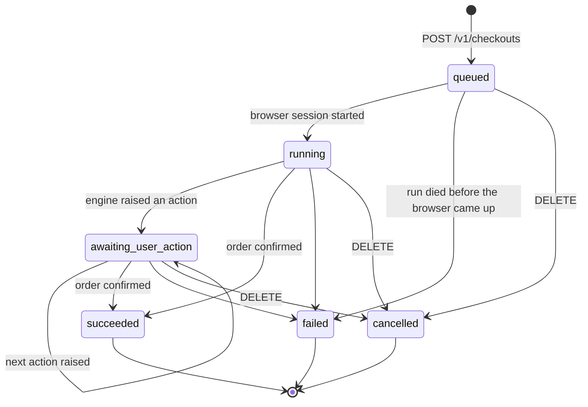

A checkout is a durable, long-running job. `POST /v1/checkouts` returns in milliseconds with
a `queued` row; the actual purchase happens in an orchestrator that survives restarts,
retries individual units of work, and can sit paused for ten minutes waiting for a human.

Everything a client needs is on the object returned by `GET /v1/checkouts/{id}`. There is one
shape and it is the same one you get back from create, from a poll, and from submitting an
action.

## Status machine



| Status | Meaning |
| --- | --- |
| `queued` | Created, enqueued, no browser yet. |
| `running` | A browser session exists and the engine is driving it. |
| `awaiting_user_action` | The engine asked for something. Check `pendingUserAction`. |
| `succeeded` | An order confirmation page was reached. `receipt` is present. |
| `failed` | Terminal. `failure.reason` says which class of failure. |
| `cancelled` | Terminal, at your request via `DELETE`. No `failure` object. |

`succeeded`, `failed` and `cancelled` are terminal — nothing transitions out of them, and a
late orchestrator replay that lands on a terminal row exits immediately and reclaims the
browser.

### Answering an action returns the checkout to `running`

Submitting a `pendingUserAction` resumes the run and the status goes back to `running`, so
`awaiting_user_action` always means a human really is being waited on. A checkout can make
this round trip several times — variant, then card, then done.

Even so, prefer testing for the action itself rather than the status string: `status` is a
summary, `pendingUserAction` is the thing you actually need to render.

```ts
const needsMe   = Boolean(checkout.pendingUserAction);
const isFinished = ["succeeded", "failed", "cancelled"].includes(checkout.status);
const isWorking  = !needsMe && !isFinished;
```

Do not branch on `status === "awaiting_user_action"` alone. The same applies to webhook
consumers: you can receive two consecutive `awaiting_user_action` events for one checkout,
and there is nothing in between telling you it went back to work.

<Note>
The converse is guaranteed: **a terminal checkout never reports a `pendingUserAction`.**
Cancelling or failing a run expires any question still open, so `succeeded`, `failed` and
`cancelled` checkouts always come back with the field absent. A run that died while parked
on a card prompt does not keep advertising that prompt forever.
</Note>

## Failure reasons

`failure.reason` is one of exactly four values. The human-readable detail is **not** in
`failure` — it is in the final `terminal` progress item's `data.message`.

```json
{
  "status": "failed",
  "failure": { "reason": "automation_failed" },
  "progressItems": [
    {
      "kind": "terminal",
      "label": "Checkout failed: automation_failed",
      "data": { "message": "Could not reach the payment step" },
      "at": "2026-07-29T09:22:48.117Z",
      "sequence": 11
    }
  ]
}
```

<AccordionGroup>
  <Accordion title="max_cost_exceeded — the purchase would have cost more than you allowed">
    Enforced at two points, both **before** any card is requested and long before anything is
    charged:

    1. **Item price (Shopify tier only).** When the variant resolves, its price is compared
       against `constraints.maxCost`. This check ignores currency — the storefront product
       JSON does not state one — and covers the item price only, not shipping or tax.
       Message: `Item price 45.00 exceeds maxCost 40.00`.
    2. **Order total (both tiers).** At the moment the engine wants to raise the `card`
       action, it reports the total displayed on the page — which does include shipping and
       tax. If that exceeds `maxCost`, the run fails instead of asking you for a card.
       Message: `Order total 61.40 USD exceeds maxCost 60.00 USD`.

    The order-total comparison runs when both numbers parse and the currencies do not
    contradict each other. If the page's currency cannot be determined, the check still
    enforces against the number — a false stop is much cheaper than an uncapped purchase.

    <Warning>
    If the total cannot be read off the page at all, there is nothing to compare and the
    run proceeds to ask for a card. `maxCost` is a strong guardrail, not a hard ceiling on
    every possible page layout. Treat single-use cards with their own limit as the real
    ceiling.
    </Warning>
  </Accordion>

  <Accordion title="user_cancelled — you declined a pending action">
    Set when you `POST` `{"action":"decline"}` to a pending action. Declining is a normal,
    supported end state: you looked at what it was asking for and decided not to buy.

    Not to be confused with `DELETE /v1/checkouts/{id}`, which produces status `cancelled`
    with no `failure` object at all.
  </Accordion>

  <Accordion title="user_action_expired — nobody answered in time">
    A pending action has a TTL (10 minutes by default). If it passes with no submit and no
    decline, the orchestrator's wait times out, the action row flips to `expired`, and the
    checkout fails.

    The browser is torn down at that point. There is no way to answer late and no way to
    extend the window — an expired checkout has to be recreated. This is intentional: a
    browser parked on a merchant's payment page is a real resource with a real cost, and
    merchant checkout sessions themselves expire.
  </Accordion>

  <Accordion title="automation_failed — everything else">
    The catch-all, and the one you will actually see. Real causes, with the message you get:

    **The merchant page did not cooperate**
    - `Could not read product JSON: product JSON returned 403` — the storefront blocked or
      changed its product endpoint (retried with backoff first).
    - `Add to cart failed`
    - `Unexpected phase at https://example-store.com/...` — the Shopify engine landed on a
      URL it could not classify as product / cart / checkout / confirmation.
    - `Could not reach the payment step` — no continue button was found after several
      attempts.

    **Payment step problems**
    - `No card fields found at the payment step; frames=3 {...}` — card inputs never
      appeared. The diagnostics string reports the frame and input counts we actually saw.
    - `Could not fill card field cc-number (filled: cc-exp, cc-csc); ...` — a field would not
      hold its value. We refuse to click pay on a half-filled form: a merchant-side decline
      is a real, user-visible failure, so we stop while it is still harmless.
    - `Pay button not found at the payment step`
    - `Payment rejected by merchant: There was an issue processing your payment...` — the
      merchant declined the card. The quoted text is the visible error we read off the page.
    - `Timed out waiting for order confirmation` — the pay click landed, no confirmation
      page appeared within 90 seconds, and no visible error explained why.

    **The agent gave up (tier 2)**
    - `Agent stuck repeating click {"ref":20} with no page change`
    - `Agent made no observable progress for 12 consecutive turns`
    - `Agent exceeded step budget` — 60 turns in a single unit of work.
    - `Agent could not complete checkout`, or whatever reason the agent itself reported.

    **Budget and infrastructure**
    - `Exceeded max checkout steps` — 12 units of work, each being a phase transition, a
      checkout step, an agent run, or a user-action pause.
    - Anything thrown after the orchestrator exhausted its retries: the browser died, the
      CDP connection dropped, the engine raised. The thrown error's message is recorded.

    <Note>
    `Timed out waiting for order confirmation` deserves care in your own handling. It means
    we could not prove the order went through — not that it definitely did not. Check the
    merchant before retrying.
    </Note>
  </Accordion>
</AccordionGroup>

## The progressItems timeline

`progressItems` is an append-only, gap-free, per-checkout sequence of everything that
happened. It is the whole audit trail, and it is what you should render instead of a spinner.

```json
{
  "kind": "step",
  "label": "Selected Widget — M / Black",
  "data": { "variantId": 44127788, "price": 4210 },
  "at": "2026-07-29T09:15:02.771Z",
  "sequence": 6
}
```

| Field | Notes |
| --- | --- |
| `kind` | One of `intent_started`, `step`, `user_action`, `terminal`. |
| `label` | Human-readable. Safe to render directly. |
| `data` | Free-form object, varies by event. `{}` when there is nothing extra. |
| `at` | ISO 8601 timestamp. |
| `sequence` | Integer, starts at 1, strictly increasing per checkout, no gaps. |

Track the highest `sequence` you have rendered and append anything above it — that is the
whole diffing algorithm you need.

### Event kinds

<ResponseField name="intent_started" type="kind">
  Exactly one, always `sequence: 1`, label `Started checkout`. Written synchronously by
  `POST /v1/checkouts`, so it is already in the 201 response.
</ResponseField>

<ResponseField name="step" type="kind">
  Everything the engine does. Examples you will actually see:

  - `Browser session started` — `data` carries `{ "exitCountry": "GB" }` when the run went
    out through a country-specific proxy exit.
  - `Loaded saved merchant session` — `data: { "cookieCount": 14 }`. A stored buyer session
    was preloaded. See [Buyer sessions](/buyer-sessions).
  - `Checkout phase: product` (Shopify tier) — `data: { "url": "..." }`.
  - `Selected Widget — M / Black` — `data: { "variantId": 44127788, "price": 4210 }`, price
    in minor units.
  - `Filled contact and shipping details`
  - `Selected cheapest available shipping method`
  - `dismissed obstruction` — `data: { "via": ["#onetrust-accept-btn-handler"] }`. A cookie
    banner or promo modal was closed.
  - `agent: click — page changed` (tier 2) — `data: { "ref": 20, "targetLabel": "Add to bag" }`.
    Tier-2 timelines are one line per agent turn, with the outcome appended to the label:
    `page changed`, `no effect`, `blocked (repeat)`, or `failed: <reason>`.
  - `Filled card details` — `data: { "fields": ["cc-number", "cc-exp", "cc-csc", "cc-name"] }`.
  - `Placing order` — the irreversible click is about to happen.
  - `Order confirmed` — `data: { "merchantOrderId": "1042" }`.
</ResponseField>

<ResponseField name="user_action" type="kind">
  Written when the run asks a human for something. `data.key` carries the action's key
  (`variant`, `card`, `credentials`, `otp`, …) and the `label` is the same `message` you
  see on `pendingUserAction`.

  This is currently the only place the action key is exposed — see
  [Identifying an action](/user-actions#identifying-an-action).

  On the Shopify tier the card step writes two entries: a bare
  `Waiting for payment details` (no `data.key`) immediately before the action is persisted,
  then the keyed one. Read the newest entry that has `data.key`.
</ResponseField>

<ResponseField name="terminal" type="kind">
  Exactly one, and always last:

  - `Checkout succeeded` — `data: {}`
  - `Checkout failed: automation_failed` — `data: { "message": "..." }` when a detail exists
  - `Checkout cancelled` — `data: {}`
</ResponseField>

## The receipt

Present only on `status: "succeeded"`.

```json
"receipt": {
  "total": { "amount": "42.10", "currency": "USD" },
  "merchantOrderId": "1042",
  "evidence": { "url": "https://example-store.com/checkouts/c/abc123/thank_you" }
}
```

<ResponseField name="total" type="object | null">
  `{ amount, currency }` with `amount` as a decimal string. Read from the confirmation page,
  taking the **largest** "total"-labelled figure — confirmation pages list subtotal, shipping
  and total, and taking the first match reported subtotals as order values.

  `null` when the run reached an already-confirmed order page without us parsing a total
  (for example, a resume that landed straight on the merchant's order page).
</ResponseField>

<ResponseField name="merchantOrderId" type="string | null">
  The merchant's own order number, scraped from the confirmation page or the order URL.
  `null` when the page did not expose one in a form we recognised. Its format is entirely the
  merchant's — do not parse it.
</ResponseField>

<ResponseField name="evidence" type="object">
  Proof of what we saw. In practice `{ "url": "..." }`: the confirmation page URL at the
  moment we declared success. `{}` if nothing was captured.
</ResponseField>

<Note>
The `receipt` is our observation of the merchant's confirmation page, not a financial
record. It is what the browser saw. For anything reconciliation-grade, use the card's own
transaction record and treat `merchantOrderId` as the join key.
</Note>

## Cancelling

```bash
curl -sX DELETE https://api.checkoutvia.com/v1/checkouts/$CKV_ID \
  -H "authorization: Bearer $CKV_KEY"
```

Returns `202` with an empty body. Cancellation is asynchronous: it stops the run even while
it is parked waiting on a user action, flips the row to `cancelled`, and reclaims the
browser. Poll (or wait for the webhook) to observe `status: "cancelled"`.

A `DELETE` on an already-terminal checkout also returns `202` and does nothing. The `202` is
an acknowledgement that the request was accepted, not a claim about what state the checkout
ended in.

<Warning>
Cancel is not an undo. If the pay click has already landed, cancelling stops our automation
but does not unwind an order the merchant has already accepted.
</Warning>

## Budgets and timing

| Budget | Value | What it bounds |
| --- | --- | --- |
| Units of work per checkout | 12 | Phase transitions, checkout steps, agent runs, and user-action pauses. Exceeding it fails the run with `Exceeded max checkout steps`. |
| Agent turns per unit (tier 2) | 60 | One tool call each. |
| Consecutive no-progress turns (tier 2) | 12 | A run that changes nothing observable for 12 turns is stuck and fails early rather than burning the rest of its budget. |
| User-action TTL | 10 minutes | See [User actions](/user-actions#expiry). |
| Confirmation wait after paying | 90 seconds | |

There is no wall-clock timeout on a checkout as a whole. A run parked on a user action for
its full TTL, resumed, and parked again is behaving normally. Expect minutes end to end,
and considerably more for food-delivery-shaped flows than for retail.
